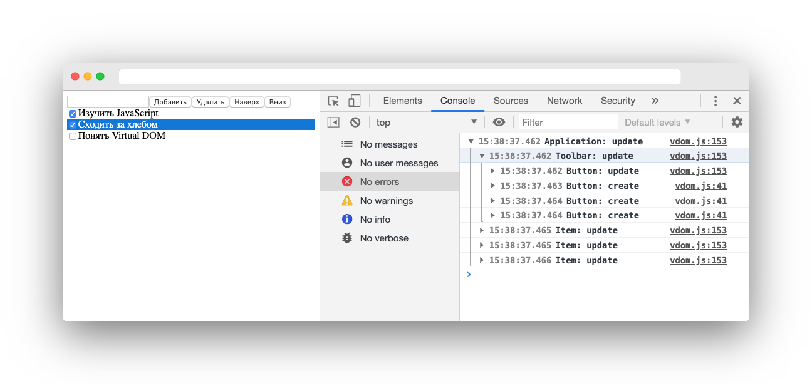

# @mail/tp-vdom-example

Учебная реализация движка Virtual DOM для курса Фронтенда в Технопарке.

## Установка

Для установки нужна относительно "свежая" версия NodeJS. Например, 12.

```bash
git clone https://github.com/8coon/tp-vdom-example.git
cd ./tp-vdom-example
npm i
```

## Использование

### Обычные ноды

Создание ноды:

```javascript
const vdom = require('vdom');

// Возвращает ноду DOM по переданному фрагменту
const node = vdom.create({
    tag: 'DIV',
    attrs: {
        style: 'background-color: gray;',
    },
    children: [
        {tag: 'INPUT', key: 'input'},
        {tag: 'BUTTON', key: 'btn-submit'},
    ],
});

// Эту ноду можно в таком виде добавить на страницу
document.body.appendChild(node);
```

Обновление ноды:

```javascript
// Обновляет ноду по переданному фрагменту
vdom.update(node, {
    tag: 'DIV',
    attrs: {
        style: 'background-color: white;',
    },
    children: [
        {tag: 'SPAN', key: 'success', children: ['Это успех!']},
    ],
});
```

Уничтожение ноды:

```javascript
vdom.destroy(node);
```

### Компоненты

Класс компонента

```javascript
export class Button extends vdom.Component {
    /**
     * attrs - атрибуты с которыми был создан компонент
     * children - дочерние узлы, которые передали в компонент при создании
     */
    constructor(attrs, children) {
        super(attrs, children);
        // Теперь attrs и children доступны как this.attrs и this.children
    }

    /**
     * Вызывается после создания компонента
     */
    didCreate() {
        // this.el - тут будет доступна корневая DOM-нода компонента
    }

    /**
     * TODO: Вызывать этот метод после вставки корневой DOM-ноды на страницу
     **/
    /* didMount() {
    } */

    /**
     * Вызывается перед обновлением компонента
     * attrs - обновлённые атрибуты компонента
     * children - новые дочерние узлы, с которыми компонент был создан
     */
    willUpdate(attrs, children) {
        super.willUpdate(attrs, children);
        // Теперь обновлённые attrs и children доступны как this.attrs и this.children
    }

    /**
     * Вызывается после обновления компонента
     */
    didUpdate() {}

    /**
     * Вызывается перед уничтожением компонента
     */
    willDestroy() {}

    /**
     * Возвращает шаблон компонента
     */
    render() {
        return {
            tag: 'BUTTON',
            attrs: {type: 'button'},
            children: [this.attrs.text],
        }
    }
}
```

## Разработка

### Запуск тестов

```bash
npm test
```

### Демо-приложение

Для иллюстрации принципов работы Virtual DOM тут есть демо-приложение.

В консоли разработчика выводятся все операции с Virtual DOM. Структура записей повторяет древовидную структуру элементов на странице.



Для запуска приложения выполните команду:

```bash
npm start
```

После чего приложение будет доступно по адресу [http://127.0.0.1:6060](http://127.0.0.1:6060/)
